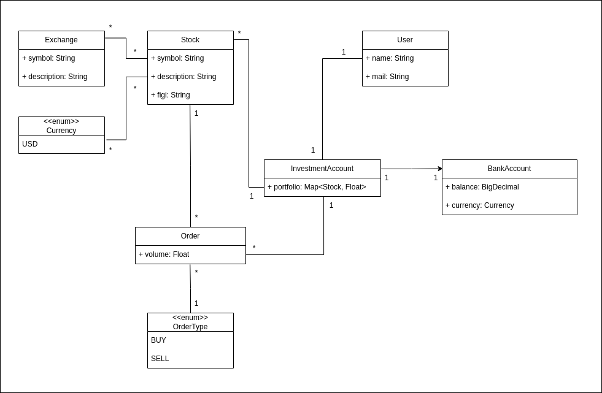

# Einführung und Ziele {#section-introduction-and-goals}

Beschreibt die wesentlichen Anforderungen, die bei
der Umsetzung der Softwarearchitektur und Entwicklung des Systems
berücksichtigt werden müssen.

Dazu gehören:

-   Projekt-Rahmenbedingungen

-   Projekt-Mindestumfang

-   Bewertungskriterien - Auf was legt er Wert?

-   wesentliche funktionale Anforderungen,

-   wesentliche nicht funktionale Anforderungen

-   Domänenmodell

-   Komponentenmodell

Das Projekt ist auf Miro dokumentiert: Siehe [Miro](https://miro.com/app/board/uXjVLD6LLSw=/)

## How to edit this file {#_how_to_edit}

Hier ganz schnell die wichtigsten Dinge zum Bearbeiten:

Ein Link sieht folgendermaßen aus: [Miro](https://miro.com/app/board/uXjVLD6LLSw=/)

Ein Bild/draw.io-Datei bindet man so ein:

Etwas **dick** macht man so.

Uns so sieht eine Tabelle aus:

+-----------------------+-----------------------------------------------+
| Begriff               | Definition                                    |
+=======================+===============================================+
| *\<Begriff-1>*        | *\<Definition-1>*                             |
+-----------------------+-----------------------------------------------+
| *\<Begriff-2*         | *\<Definition-2>*                             |
+-----------------------+-----------------------------------------------+

Have fun!

# Rahmenbedingungen {#section-rahmenbedingungen}

- **Beginn**: Dienstag, 03.12.2024
- **Code Freeze**: Sonntag, 19.01.2024, 23:59
- **Abgabe Gesamtpaket** (Code + Dokumentation + Präsentation): Montag, 20.01.2024, 23:59
- **Präsentation**: Dienstag, 21.01.2024

# Projekt-Mindestumfang {#section-projekt-mindestumfang}

- **Reaktive Kotlin Spring Boot Webflux Server Applikation**
- **Anbindung externer API(s)**
- **Anbindung einer Datenbank mit R2DBC**
- **Kleines Frontend**, das eure Applikation ein wenig visualisiert
    - Kann so hacky gebaut sein, wie ihr wollt
    - Fließt, wenn überhaupt, nur geringfügig in die Bewertung ein
- **Test Coverage**: Mindestens für die Kernfunktionen
- **Ausreichende Dokumentation**:
    - **Kommentare**: Falls der Code nicht selbsterklärend ist 
    (*besser: Code so schreiben, dass er selbsterklärend ist*)
    - **README**: Anleitung zur Konfiguration und Nutzung
      - **Optionale Dokumentation**: Erklärungen, warum bestimmte Entscheidungen 
        getroffen oder Dinge so umgesetzt wurden

# Bewertungskriterien - Auf was legt er Wert? {#section-bewertungskriterien}

- **Idiomatic use of Kotlin features**, i.e.:
    - Scope functions
    - Extension functions where it makes sense
    - Passing functions as arguments
- **Clean Code**
- **Project and package structure / architecture**
- **Naming** of:
    - Classes
    - Functions
    - Variables
- **Separation of concerns**:
    - Who is responsible for what?

- **Grading structure**:
    - **Project grade** (Code + Documentation + Presentation)
    - **Individual grade**:
        - Based on particularly good or less good engagement within the group
    - These combine to form your **personal overall grade**.

# Wesentliche funktionale Anforderungen {#section-nicht-anforderungen}

## Minimal Viable Product (MVP)

## Stretch Goals

# Wesentliche nicht funktionale Anforderungen {#section-nicht-fkt-anforderungen}

# Domänenmodell {#section-domaenenmodell}

# Komponentenmodell {#section-komponentenmodell}

# Glossar {#section-glossary}

Die wesentlichen fachlichen und technischen Begriffe, die Stakeholder im
Zusammenhang mit dem System verwenden.

+-----------------------+-----------------------------------------------+
| Begriff               | Definition                                    |
+=======================+===============================================+
| *\<Begriff-1>*        | *\<Definition-1>*                             |
+-----------------------+-----------------------------------------------+
| *\<Begriff-2*         | *\<Definition-2>*                             |
+-----------------------+-----------------------------------------------+