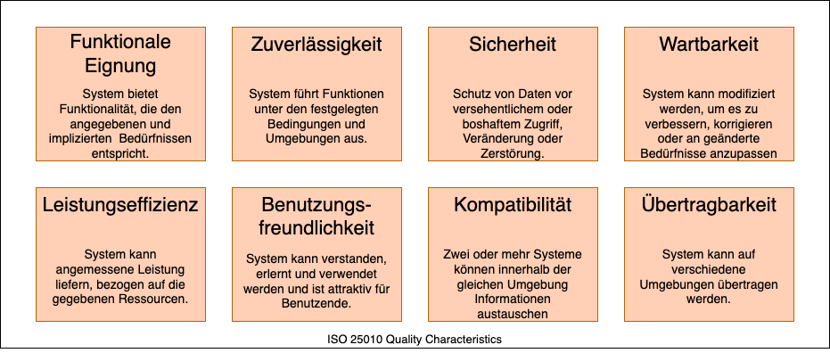

# Einführung und Ziele {#section-introduction-and-goals}

Beschreibt die wesentlichen Anforderungen, die bei
der Umsetzung der Softwarearchitektur und Entwicklung des Systems
berücksichtigt werden müssen.

Dazu gehören:

-   Projekt-Mindestumfang

-   Bewertungskriterien - Auf was lege ich Wert?

-   wesentliche funktionale Anforderungen,

-   wesentliche nicht funktionale Anforderungen

-   Domänenmodell

-   Komponentenmodell

Das Projekt ist auf Miro dokumentiert: Siehe [Miro](https://miro.com/app/board/uXjVLD6LLSw=/)

## How to edit this file {#_how_to_edit}

Hier ganz schnell die wichtigsten Dinge zum Bearbeiten:

Ein Link sieht folgendermaßen aus: [Miro](https://miro.com/app/board/uXjVLD6LLSw=/)

Ein Bild/draw.io-Datei bindet man so ein:

Etwas **dick** macht man so.

Uns so sieht eine Tabelle aus:

+-----------------------+-----------------------------------------------+
| Begriff               | Definition                                    |
+=======================+===============================================+
| *\<Begriff-1>*        | *\<Definition-1>*                             |
+-----------------------+-----------------------------------------------+
| *\<Begriff-2*         | *\<Definition-2>*                             |
+-----------------------+-----------------------------------------------+

Have fun!

# Bausteinsicht {#section-building-block-view}

# Glossar {#section-glossary}

Die wesentlichen fachlichen und technischen Begriffe, die Stakeholder im
Zusammenhang mit dem System verwenden.

+-----------------------+-----------------------------------------------+
| Begriff               | Definition                                    |
+=======================+===============================================+
| *\<Begriff-1>*        | *\<Definition-1>*                             |
+-----------------------+-----------------------------------------------+
| *\<Begriff-2*         | *\<Definition-2>*                             |
+-----------------------+-----------------------------------------------+